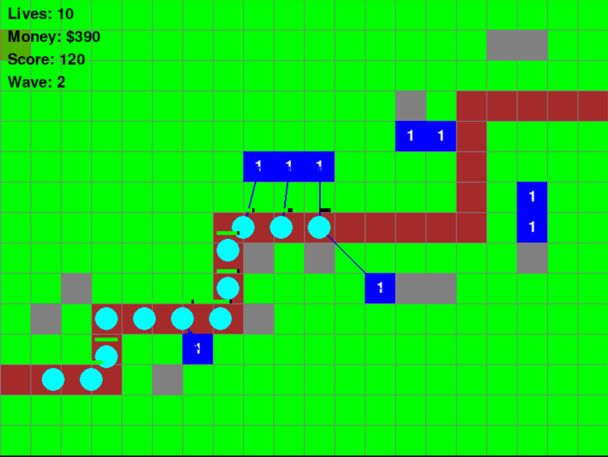
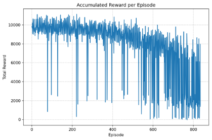
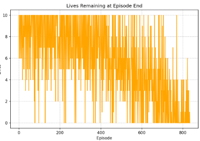
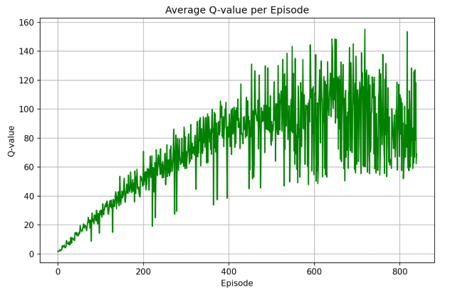
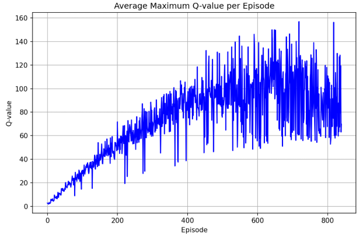

# Strategic Generalization in Tower Defense: A Deep Q-Network Approach

> Can a DQN agent learn tower defense strategies that transfer across map configurations it has never seen? This project explores where value-based reinforcement learning breaks down in sequential spatial-resource allocation problems.




---

## Table of Contents

- [The Problem](#the-problem)
- [Key Design Decisions](#key-design-decisions)
- [Architecture](#architecture)
- [Results](#results)
- [Failure Analysis](#failure-analysis)
- [What This Project Established](#what-this-project-established)
- [Environment Details](#environment-details)
- [Project Structure](#project-structure)
- [How to Run](#how-to-run)
- [References](#references)

---

## The Problem

Tower defense requires an agent to make sequential resource allocation decisions on a spatial grid — where to place towers, when to upgrade, and when to save money — while enemies traverse predefined paths. The challenge intensifies when we ask: **can an agent trained on some maps generalize its strategy to maps it has never seen?**

This involves a combinatorial action space (61 discrete actions), delayed reward signals (a bad placement only matters waves later), and spatial reasoning that must transfer across different map geometries.

## Key Design Decisions

**Why strategic position abstraction?** Instead of learning absolute grid coordinates (which are meaningless on a different map), tower positions are categorized by proximity to enemy paths — close, medium, and far. This gives the agent a 61-action space with consistent semantic meaning across any map layout. The agent learns *"place at a medium-distance position"* as a transferable concept rather than *"place at cell (7, 4)."*

**Why a dual-input state representation?** Tower defense requires both spatial understanding (where are paths, towers, enemies on the grid?) and scalar awareness (how much money do I have, what wave is it?). We process these through separate pathways — a CNN for the 4-channel spatial grid and a fully connected branch for the 4-dimensional scalar vector — before merging them.

**Why proximity-scaled rewards?** Placing a tower close to a path earns more reward than placing one far away. This intrinsically guides the agent toward effective positions without hardcoding "place towers here" — the agent discovers choke points through reward shaping rather than explicit instruction.

## Architecture

```
Grid State (4ch x 20x15)  -->  CNN [Conv2d x3]  -->  Flatten
                                                        \
                                                         Merge --> FC Layers --> Q-values (61 actions)
                                                        /
Scalar State (4-dim)       -->  FC Layer         -->  ...
```

**DQN components:**
- **Experience replay** (capacity: 10,000) — breaks correlation between sequential observations
- **Target network** updated every 10 episodes — stabilizes learning targets
- **Epsilon-greedy exploration** decaying from 1.0 to 0.01 (decay rate: 0.99995)
- **Smooth L1 loss** with gradient clipping to [-1, 1]

**State representation channels:**
- Tower placement grid (binary)
- Path distance map (normalized Euclidean distance to nearest path)
- Coverage map (% of path within tower range from each buildable cell)
- Enemy density map (normalized enemy health at each position)

## Results

### The agent failed to generalize — and the failure pattern is revealing.

Training ran for 800 episodes across multiple maps. Four metrics tell the story:

### Reward Decline Despite Training



Rewards peaked in early episodes then declined steadily. The agent initially found reasonable strategies but couldn't sustain them as it encountered more map variation.

### Progressive Survival Collapse



Survival dropped from full health in early episodes to near-zero by episode 400+. More training made the agent *worse* at staying alive.

### Q-Value Overestimation





Q-values rose consistently throughout training while actual performance collapsed. The agent became increasingly *confident* in decisions that were getting worse — the classic DQN overestimation failure mode.

## Failure Analysis

**Q-value overestimation** — DQN's max operator in the Bellman target systematically inflates value estimates. Over 800 episodes, the agent locked into overconfident suboptimal policies. Q-values went up while rewards went down.

**No temporal memory** — Each state is processed independently. The agent can't remember what it built 50 steps ago, what wave patterns it observed, or how its resource allocation evolved. Tower defense fundamentally requires sequential reasoning that a feedforward network cannot provide.

**No structured learning progression** — Maps were presented without difficulty ordering. The agent faced complex multi-path maps before mastering simple ones, leading to unstable, fragmented policies.

**Catastrophic forgetting** — Strategies learned on earlier maps were overwritten by new experiences. The 10,000-capacity replay buffer wasn't sufficient to maintain diverse cross-map knowledge.

## What This Project Established

Despite not solving the generalization problem, this work produced concrete outcomes:

- **A reusable tower defense RL environment** — fully functional game engine with multiple enemy types, tower upgrades, configurable maps, and a clean `step(action) -> (state, reward, done)` interface ready for any RL algorithm
- **Strategic position abstraction** — the close/medium/far categorization proved to be a sound design for map-agnostic action spaces, independent of the learning algorithm
- **A robust state representation** — the 4-channel spatial grid + scalar vector provides sufficient information for strategic learning (the representation isn't the bottleneck)
- **Clear diagnosis of failure modes** — Q-value overestimation, lack of temporal context, absence of curriculum structure, and catastrophic forgetting identified as distinct root causes

## Environment Details

**Grid**: 20x15 cells | **Tower upgrades**: Up to 4 levels | **Training**: 800 episodes across multiple maps

| Enemy Type | Health | Speed | Reward |
|---|---|---|---|
| Normal | 100 | 2.0 | 20 |
| Fast | 60 | 3.5 | 25 |
| Tank | 250 | 1.2 | 40 |
| Boss | 500 | 1.0 | 100 |

## Project Structure

```
├── game.py              # Tower defense environment (Enemy, Tower, Projectile, GameManager)
├── dqn_agent.py         # DQN network, ReplayBuffer, DQNAgent
├── maps.py              # Map configurations and definitions
├── main.py              # Training and testing entry point
└── assets/              # Graphs and figures for README
```

## How to Run

```bash
# Install dependencies
pip install torch pygame numpy

# Train the agent
python main.py
# Select 'train' when prompted, set episodes (default: 1000)

# Test with a trained model
python main.py
# Select 'test' when prompted, provide model path
```

## References

- Mnih et al. (2013) — [Playing Atari with Deep Reinforcement Learning](https://arxiv.org/abs/1312.5602)
- Mnih et al. (2015) — [Human-level Control through Deep RL](https://www.nature.com/articles/nature14236)
- Vinyals et al. (2017) — [StarCraft II: A New Challenge for RL](https://arxiv.org/abs/1708.04782)
- Narvekar et al. (2020) — [Curriculum Learning for RL Domains](https://jmlr.org/papers/v21/20-212.html)
- Schaul et al. (2015) — [Prioritized Experience Replay](https://arxiv.org/abs/1511.05952)
